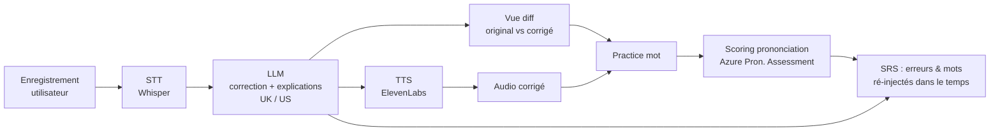
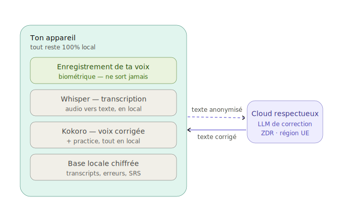

# PRD simplifié  App d'entraînement à l'anglais parlé pour développeurs

> **Nom de travail :** *Loqua*
> **En une phrase :** Tu parles anglais, l'app te renvoie une version native corrigée + expliquée, te fait travailler ta prononciation mot par mot, et transforme tes erreurs en un entraînement personnalisé qui te suit dans le temps.

---

## 1. Le problème

Les devs non-anglophones comprennent souvent bien l'anglais écrit, mais **bloquent à l'oral** : vocabulaire technique approximatif, tournures « traduites du français », prononciation incertaine sur des mots pourtant courants. Les apps généralistes (Duolingo & co) ne collent ni au contexte pro (standup, code review, incident) ni au besoin de *production libre* corrigée.

**Cible :** développeur intermédiaire→avancé qui veut parler un anglais pro naturel, en 10 min/jour.

---

## 2. Ce qui différencie l'app (principes de conception)

Ces principes viennent directement du fait que « écouter une version parfaite » ne suffit pas à progresser :

1. **Production active > écoute passive.** L'utilisateur produit d'abord, l'IA corrige ensuite.
2. **Feedback sur SA voix.** Pas seulement « voici la bonne version », mais « voici où *ta* prononciation décroche » (scoring phonème).
3. **Comprendre le pourquoi.** Chaque correction est catégorisée et expliquée en une phrase.
4. **Correction graduée.** 3 niveaux : *minimal* (juste les fautes) / *naturel* / *natif + idiomatique*. L'utilisateur choisit selon son niveau.
5. **Tes erreurs deviennent ton programme.** Répétition espacée (SRS) sur tes fautes récurrentes et tes mots difficiles.
6. **Habitude > intensité.** Sessions courtes, streak quotidien, friction minimale.

---

## 3. Concurrence & différence

Le créneau de l'entraînement oral à l'anglais assisté par IA est déjà occupé. Voici les principaux outils, ce qui les caractérise, puis là où Loqua se place différemment.

### Panorama

| Outil | Ce qu'il fait | Lien |
|---|---|---|
| **ELSA Speak** | Spécialiste de la prononciation : feedback **phonème par phonème**, identifie les sons précis mal prononcés. Approche généraliste (pas de contexte métier). | [elsaspeak.com](https://www.elsaspeak.com) |
| **ChatGPT (mode vocal avancé)** | Conversation orale temps réel, correction de grammaire et d'intonation, jeux de rôle, aide à la prononciation (texte + audio). | [openai.com/chatgpt](https://openai.com/chatgpt) |
| **Speak** | Leçons structurées, expérience mobile soignée, pratique orale guidée. | [speak.com](https://www.speak.com) |
| **Talkio AI** | Large couverture de langues et de dialectes, tuteurs IA, feedback de prononciation en temps réel. | [talkio.ai](https://www.talkio.ai) |
| **Langua** | Conversation avec des voix clonées de locuteurs natifs, pour un rendu plus naturel. | [languatalk.com](https://languatalk.com/langua) |

### Ce qui distingue Loqua

Trois différences factuelles se dégagent de ce panorama :

1. **Les données restent sur l'appareil.** Les outils ci-dessus reposent sur des services cloud : l'audio une donnée biométrique  est envoyé vers des serveurs tiers. Loqua fait tourner le cœur du traitement **en local** (cf. §12) : la voix ne quitte pas la machine.

2. **Un contexte pensé pour les développeurs.** Les apps existantes sont généralistes. Loqua travaille sur des situations concrètes du métier : standup, code review orale, post-mortem d'incident, explication d'une décision d'archi, interview technique.

3. **Une correction explicite, pas seulement de la compréhension.** Un assistant conversationnel généraliste *comprend* l'utilisateur même quand la prononciation est approximative  et ne le reprend donc pas toujours. Loqua produit une correction **explicite et catégorisée** de chaque écart (cf. §2) et fait retravailler les points faibles dans le temps (SRS).

> Honnêteté : sur la finesse du scoring phonème, ELSA est aujourd'hui la référence établie. C'est pour Loqua un objectif progressif (cf. §12), pas un acquis.

---

## 4. Boucle principale (le cœur du MVP)

```
1. ENREGISTRER   → l'utilisateur parle en anglais (ex. décrire sa journée de dev)
2. TRANSCRIRE    → speech-to-text (Whisper)
3. CORRIGER      → LLM : syntaxe, grammaire, vocabulaire natif, choix UK/US
                   → renvoie {texte corrigé, liste des corrections + explications}
4. RESTITUER     → text-to-speech (ElevenLabs) lit la version corrigée (voix UK ou US)
5. COMPARER      → vue "diff" original ↔ corrigé, corrections surlignées et cliquables
6. S'ENTRAÎNER   → sur n'importe quel mot du transcript : practice prononciation
```

### Diagramme de flux



---

## 5. Feature : entraînement à la prononciation d'un mot

C'est la feature « boucle sur le mot *interesting* », formalisée et musclée.

**Depuis le transcript, l'utilisateur tape sur n'importe quel mot** → un panneau s'ouvre :

- ▶️ **Bouton lecture** : joue le mot isolé (extrait du TTS ou re-synthétisé).
- 🔁 **Mode boucle** : répète le mot automatiquement toutes les *N* secondes (défaut 1,5 s, réglable), pour répéter en même temps derrière.
- 🐢 **Vitesse réglable** : 0.5× / 0.75× / 1× (pour décomposer les mots durs).
- 🔤 **Transcription phonétique (IPA)** + découpage syllabique : `interesting → /ˈɪn.trəs.tɪŋ/`.
- 🎙️ **Enregistre-toi & compare** : tu répètes, l'app **score ta prononciation** (phonème par phonème) et surligne en rouge la syllabe ratée.
- 👯 **Paires minimales** (V2) : si tu rates un son récurrent (ex. `/ɪ/` vs `/iː/`), l'app te propose *ship / sheep*, *bit / beat*…

> Sans le scoring, la boucle reste passive. **C'est le scoring qui transforme la répétition en apprentissage.**

---

## 6. Gamification & progression (pour la rétention)

| Mécanique | Détail |
|---|---|
| **XP** | Gagnés par session, par mot maîtrisé, par prononciation validée. |
| **Streak** | Jours consécutifs à avoir parlé ≥1 min. C'est le moteur d'habitude n°1. |
| **Niveaux / rangs** | Progression visible (ex. *Junior → Confirmé → Senior speaker*). |
| **Badges** | « Premier standup décrit », « 100 mots maîtrisés », « 7 jours d'affilée », « Son /θ/ dompté ». |
| **Tableau de progrès** | Courbe du taux d'erreur, minutes parlées, vocabulaire unique utilisé, scores de prononciation dans le temps. |
| **Deck SRS personnel** | Tes fautes récurrentes + mots difficiles reviennent au bon moment (répétition espacée). **La feature la plus forte pour progresser.** |
| **Défis « scénario »** | Prompts contextualisés dev : *décris un bug*, *fais une code review orale*, *explique une décision d'archi*, *raconte un post-mortem d'incident*, *réponds en interview technique*. |
| **Mode Shadowing** (V2) | Parler *en même temps* que l'audio de référence pour caler rythme et intonation. |

---

## 7. Stack technique  options

### Client (mobile + desktop)

| Option                                         | Portée |
|------------------------------------------------|---|
| **A. Expo (React Native)**     | iOS, Android, Web (1 codebase). Desktop via PWA ou wrapper Tauri. | 
| **B. Next.js (web-first) + Capacitor + Tauri** | PWA → wrappée mobile (Capacitor) & desktop (Tauri). | 

### Backend (un seul service fin, pas un BFF par client)

Pour ne **jamais** avoir les clés d'API sur le client. Le cœur de l'app tourne on-device (cf. §12) ; le serveur reste minimal.

- **Service edge/proxy :** serverless (Cloudflare Workers / Vercel)  proxy LLM cloud (fallback), auth, billing, sync chiffré E2E.
- **Tout-en-un solo-friendly : Supabase** → Auth + Postgres + Storage + Edge Functions.
- **Stockage audio :** local par défaut (IndexedDB / SQLCipher) ; cloud (R2 / S3) seulement si l'utilisateur opte pour la sync.

### APIs externes (les briques IA)

| Fonction | Choix principal                                                                | Alternatives |
|---|--------------------------------------------------------------------------------|---|
| **Speech-to-Text** | OpenAI **Whisper** (API)                                                       | `whisper.cpp` **on-device** (coût ↓, privacité ↑), Deepgram, AssemblyAI, STT natif iOS/Android |
| **Correction (LLM)** | **Claude** / GPT-4-class, sortie **JSON structurée**                           |  |
| **Text-to-Speech** | **ElevenLabs** (voix en-GB & en-US, top qualité ; peut même *cloner une voix*) | OpenAI TTS, Azure TTS |
| **Scoring prononciation** | **Azure Pronunciation Assessment** (score par phonème  la brique clé)         | Speechace |

**Sortie LLM attendue (JSON) :**
```json
{
  "variant": "en-US",
  "corrected_text": "...",
  "corrections": [
    {
      "original": "I have make a deploy",
      "fixed": "I deployed",
      "type": "grammar",
      "explanation": "En anglais on emploie le verbe 'deploy' directement, pas la construction 'make a deploy'."
    }
  ]
}
```

---

## 8. Architecture (composants)

```
┌─────────────────────────────┐
│  CLIENT (Expo)              │  enregistrement, UI diff, practice mot, gamification
│  iOS / Android / Desktop    │
└──────────────┬──────────────┘
               │ HTTPS
┌──────────────▼──────────────┐
│  BFF / Edge Functions       │  orchestration + garde les clés API
│  (Supabase / Hono)          │
└───┬─────┬─────┬─────┬───────┘
    │     │     │     │
    ▼     ▼     ▼     ▼
 Whisper  LLM  Eleven Azure     ← services IA
   STT   corr.  Labs   Pron.
    │     │     │     │
┌───▼─────▼─────▼─────▼───────┐
│  DB Postgres + Storage      │  users, sessions, corrections, SRS, scores, XP
└─────────────────────────────┘
```

### Modèle de données (esquisse)

- **users** : id, niveau, variante préférée (UK/US), voix TTS
- **sessions** : id, user_id, audio_url, transcript, corrected_text, variant, created_at
- **corrections** : id, session_id, type, original, fixed, explanation
- **pronunciation_attempts** : id, user_id, word, score, phoneme_scores(json), created_at
- **srs_items** : id, user_id, item, type(mot/faute), ease, interval, next_review
- **gamification** : user_id, xp, streak, level, badges(json)

---

## 9. Coûts (à garder en tête)

Chaque session appelle des APIs payantes (STT + LLM + TTS + scoring). Pour un usage perso c'est faible ; à l'échelle ça grimpe.
- **Plus gros levier d'économie :** passer le **STT en on-device** (`whisper.cpp` / STT natif) → supprime le coût récurrent le plus fréquent et améliore la privacité.
- **TTS ElevenLabs** facturé au caractère : ne re-synthétise que si le texte change ; mets en cache les mots pour la practice.

---

## 10. Roadmap par phases

**Phase 0  MVP (la boucle principale)**
Enregistrer → Whisper → correction LLM (3 niveaux, UK/US, avec explications) → lecture ElevenLabs → vue diff → tap-sur-mot + mode boucle/vitesse. *But : prouver la boucle.*

**Phase 1  Ça fait progresser**
Scoring de prononciation (Azure) + enregistre-toi & compare · dashboard des erreurs récurrentes · deck SRS de tes fautes · streak + XP.

**Phase 2  Ça accroche & ça s'approfondit**
Défis scénarios dev · shadowing · paires minimales · badges · analytics avancées · STT on-device · (option) clonage de ta propre voix pour t'entendre « corrigé mais avec ta voix ».

---
## 11. Les tarifs unitaires (mi-2026)

### Coûts par brique

| Brique | Détail |
|---|---|
| **Transcription (STT)** | Whisper : \$0,006/min (\$0,36/h). `gpt-4o-mini-transcribe` : \$0,003/min. |
| **Correction (LLM)** | Négligeable (quelques centimes). GPT-4.1 : \$2 en entrée / \$8 en sortie par million de tokens  soit ~quelques dixièmes de centime pour une minute de parole. |
| **Synthèse vocale (TTS ElevenLabs)** | \$0,10 / 1 000 caractères (Multilingual v2/v3) ou \$0,05 (Flash/Turbo). Une minute de parole ≈ ~800 caractères. |
| **Scoring de prononciation (Azure)** | \$1,32/h (~\$0,00037/s) en temps réel, soit ~\$0,022/min  et seulement quand l'utilisateur s'entraîne sur des mots. |

### Coût de la boucle par minute de parole

| Setup | STT | LLM | TTS (~800 car.) | **Total /min** |
|---|---|---|---|---|
| **Premium**  Whisper + GPT-4.1 + ElevenLabs Multilingual | \$0,006 | ~\$0,003 | \$0,080 | **~\$0,09** |
| **Budget**  mini-transcribe + mini-LLM + ElevenLabs Flash | \$0,003 | ~\$0,001 | \$0,040 | **~\$0,045** |
| **Optimisé**  STT on-device + OpenAI TTS + mini-LLM | ~\$0 | ~\$0,001 | ~\$0,012 | **~\$0,013** |

> 👉 Le TTS pèse **80–90 % de la facture**. C'est là que tout se joue.

### Coût par personne et par mois (30 j)

| Scénario | 10 min/jour | 1 h/jour |
|---|---|---|
| **Premium** | ~\$27 /mois | ~\$162 /mois |
| **Budget** | ~\$13,50 /mois | ~\$81 /mois |
| **Optimisé** | ~\$4 /mois | ~\$23 /mois |

---

## 12. Cloud vs on-device : arbitrages par brique

Les quatre briques du pipeline ne réagissent pas de la même façon au « tout local » : deux sont résolues hors-cloud, une implique un compromis de qualité, une seule reste difficile.

### Trois niveaux de confidentialité

| Niveau | Principe | Contrepartie |
|---|---|---|
| **Cloud respectueux** | APIs cloud avec Zero-Data-Retention, chiffrement, région UE, pas d'entraînement sur les données. | Qualité maximale, mais l'audio quitte l'appareil. |
| **Hybride on-device-first** | L'audio reste local ; seul du texte anonymisé peut sortir vers le cloud. | Bon équilibre confidentialité / qualité. |
| **100 % on-device** | Rien ne quitte l'appareil. | Confidentialité absolue, au prix de la qualité, de la taille de l'app et des prérequis matériels. |

### Faisabilité par brique

| Brique | Option locale | 100 % local ? | Qualité vs cloud | Statut |
|---|---|---|---|---|
| **STT** (transcription) | whisper.cpp / WhisperKit | ✅ Oui | ≈ équivalente | Résolue |
| **TTS** (voix corrigée) | Kokoro-82M / Piper | ✅ Oui | Excellente en voix neutre | Résolue |
| **LLM** (correction) | Gemma / Qwen / Phi 1-4B, Apple Foundation | ⚠️ Partiel | En retrait sur mobile | Compromis |
| **Scoring** prononciation | GOP + wav2vec2 (Kaldi) | 🔴 Difficile | En retrait, effort élevé | Non résolue |

- **STT**  Mature en local. `whisper.cpp` (iOS/Android/desktop) et WhisperKit (Neural Engine Apple) offrent une transcription temps réel hors-ligne, à qualité équivalente au cloud. L'audio (donnée biométrique RGPD) ne sort jamais.
- **TTS**  Mature en local. Kokoro-82M tourne sur CPU (300 Mo), qualité proche d'ElevenLabs en écoute courante, US/UK uniquement, sans nuance émotionnelle  suffisant pour une voix de référence neutre. Piper couvre les appareils très basse puissance. Clonage de voix local (Chatterbox, VoxCPM) : approximatif, à réserver à une V2.
- **LLM**  Le compromis central. Un modèle 1-3B (dont Apple Foundation ~3B sur iOS 26+) corrige les fautes évidentes, mais le choix du mot le plus idiomatique reste l'avantage des modèles cloud (GPT-4 / Claude). L'écart se referme sur desktop (Phi-4 14B, Gemma 3, jusqu'à 14-27B). La correction ne porte que du **texte** : un éventuel appoint cloud n'expose jamais l'audio.
- **Scoring**  Le point dur. Voie open-source via méthode GOP (corpus SpeechOcean762, recette Kaldi, alignement wav2vec2). Représente une vraie charge d'ingénierie ML ; modèle ~300M viable sur desktop, lourd sur mobile ; calibrage inférieur à Azure. Alternative V1 : « enregistre-toi et compare à l'oreille » (aucun modèle de scoring).

### Comparatif Cloud vs 100 % on-device

| Critère | Cloud | 100 % on-device |
|---|---|---|
| **Confidentialité** | Bonne (si ZDR) | Absolue |
| **Coût récurrent** | \$13-160/mois/user | ~\$0 |
| **Qualité correction** | Native, top | Correcte→bonne (mobile), très bonne (desktop) |
| **Scoring prononciation** | Turnkey (Azure) | Faisable, effort élevé |
| **Taille de l'app** | Légère | Lourde (plusieurs Go de modèles) |
| **Prérequis matériel** | Tout appareil | Téléphone récent (8 Go+ RAM) / bon desktop |
| **Batterie / chauffe** | Nulle | Réelle sur mobile en usage soutenu |
| **Hors-ligne** | Non | Oui |

### Orientation possible pour un positionnement privacy-first

1. **Audio 100 % local**  STT (Whisper) + TTS (Kokoro) sur l'appareil : élimine la donnée la plus sensible, déjà faisable.
2. **Correction on-device par défaut**, avec option opt-in « correction avancée » n'envoyant que du texte à un LLM cloud ZDR.
3. **Desktop comme cible du 100 % privacy** (RAM/GPU → modèles plus gros, pas de contrainte batterie) ; mobile pour le grand public.
4. **Scoring progressif**  « compare à l'oreille » en V1, GOP local en V2, d'abord sur desktop.

### Limites actuelles

- Égaler la réécriture « native idiomatique » de GPT-4/Claude **entièrement sur mobile** : hors de portée (le desktop 14-27B s'en approche).
- Clonage de voix local à la fidélité ElevenLabs : approximatif.
- Streaming temps réel complet sur téléphone bas de gamme : contraint → viser le post-enregistrement.


