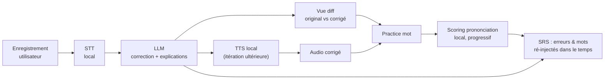

# PRD — App d'entraînement à l'anglais parlé pour développeurs

> **Nom de travail :** *Loqua*
> **En une phrase :** L'utilisateur parle anglais, l'app lui renvoie une version native corrigée + expliquée, le fait travailler sa prononciation mot par mot, et transforme ses erreurs en un entraînement personnalisé qui le suit dans le temps.
>
> **Portée de ce document :** le *quoi* et le *pourquoi* (produit). Le *comment* (stack, ports, données, coûts, plan de validation) vit dans [`ARCHITECTURE.md`](ARCHITECTURE.md) et [`../SPIKES.md`](SPIKES.md), seule source de vérité technique.

---

## 1. Le problème

Les devs non-anglophones comprennent souvent bien l'anglais écrit, mais **bloquent à l'oral** : vocabulaire technique approximatif, tournures « traduites du français », prononciation incertaine sur des mots pourtant courants. Les apps généralistes (Duolingo & co) ne collent ni au contexte pro (standup, code review, incident) ni au besoin de *production libre* corrigée.

**Cible :** développeur intermédiaire→avancé qui veut parler un anglais pro naturel, en 10 min/jour.

---

## 2. Principes de conception (ce qui différencie l'app)

Ces principes viennent directement du fait que « écouter une version parfaite » ne suffit pas à progresser :

1. **Production active > écoute passive.** L'utilisateur produit d'abord, l'IA corrige ensuite.
2. **Feedback sur SA voix.** Pas seulement « voici la bonne version », mais « voici où *sa* prononciation décroche ». *(Objectif : scoring phonème ; démarrage par une comparaison à l'oreille — cf. §5 et §8.)*
3. **Comprendre le pourquoi.** Chaque correction est catégorisée et expliquée en une phrase.
4. **Correction graduée.** *Vision :* 3 niveaux (*minimal* / *naturel* / *natif + idiomatique*) au choix de l'utilisateur. *MVP :* un seul niveau (« naturel ») — les autres viendront s'ils sont réclamés (cf. §8).
5. **Ses erreurs deviennent son programme.** Répétition espacée (SRS) sur ses fautes récurrentes et ses mots difficiles. **C'est le vrai levier de progression et le différenciateur le plus défendable.**
6. **Habitude > intensité.** Sessions courtes, streak quotidien, friction minimale.

---

## 3. Concurrence & différence

Le créneau de l'entraînement oral à l'anglais assisté par IA est déjà occupé. Voici les principaux outils, ce qui les caractérise, puis là où Loqua se place différemment.

### Panorama

| Outil | Ce qu'il fait | Lien |
|---|---|---|
| **ELSA Speak** | Spécialiste de la prononciation : feedback **phonème par phonème**, identifie les sons précis mal prononcés. Approche généraliste (pas de contexte métier). | [elsaspeak.com](https://www.elsaspeak.com) |
| **ChatGPT (mode vocal avancé)** | Conversation orale temps réel, correction de grammaire et d'intonation, jeux de rôle, aide à la prononciation (texte + audio). | [openai.com/chatgpt](https://openai.com/chatgpt) |
| **Speak** | Leçons structurées, expérience mobile soignée, pratique orale guidée. | [speak.com](https://www.speak.com) |
| **Talkio AI** | Large couverture de langues et de dialectes, tuteurs IA, feedback de prononciation en temps réel. | [talkio.ai](https://www.talkio.ai) |
| **Langua** | Conversation avec des voix clonées de locuteurs natifs, pour un rendu plus naturel. | [languatalk.com](https://languatalk.com/langua) |

### Ce qui distingue Loqua

Trois différences factuelles se dégagent de ce panorama :

1. **Les données restent sur l'appareil.** Les outils ci-dessus reposent sur des services cloud : l'audio — une donnée biométrique — est envoyé vers des serveurs tiers. Loqua fait tourner le cœur du traitement **en local** (cf. §7) : la voix ne quitte pas la machine.

2. **Un contexte pensé pour les développeurs.** Les apps existantes sont généralistes. Loqua travaille sur des situations concrètes du métier : standup, code review orale, post-mortem d'incident, explication d'une décision d'archi, interview technique.

3. **Une correction explicite, pas seulement de la compréhension.** Un assistant conversationnel généraliste *comprend* l'utilisateur même quand la prononciation est approximative — et ne le reprend donc pas toujours. Loqua produit une correction **explicite et catégorisée** de chaque écart (cf. §2) et fait retravailler les points faibles dans le temps (SRS).

> Sur la finesse du scoring phonème, ELSA est aujourd'hui la référence établie. C'est pour Loqua un **objectif progressif** (cf. §5 et §8), pas un acquis.

---

## 4. Boucle principale (le cœur du produit)

```
1. ENREGISTRER   → l'utilisateur parle en anglais (ex. décrire sa journée de dev)
2. TRANSCRIRE    → speech-to-text LOCAL (l'audio ne sort pas)
3. CORRIGER      → LLM : syntaxe, grammaire, vocabulaire natif
                   → renvoie {texte corrigé, liste des corrections + explications}
4. COMPARER      → vue "diff" original ↔ corrigé, corrections surlignées et cliquables
5. RESTITUER     → text-to-speech LOCAL lit la version corrigée (itération ultérieure)
6. S'ENTRAÎNER   → sur n'importe quel mot du transcript : practice prononciation
```

> Le MVP s'arrête volontairement à l'étape **4 (diff)** — c'est ce qui prouve la valeur de la correction async. TTS et practice arrivent ensuite (cf. §8).

### Diagramme de flux



**Exemple de correction** (le format exact est défini dans [`ARCHITECTURE.md`](ARCHITECTURE.md) §9) :

> *« I have make a deploy »* → *« I deployed »* — type : **grammar** — « En anglais on emploie le verbe *deploy* directement, pas la construction *make a deploy*. »

---

## 5. Feature : entraînement à la prononciation d'un mot

C'est la feature « boucle sur le mot *interesting* », formalisée et musclée.

**Depuis le transcript, l'utilisateur tape sur n'importe quel mot** → un panneau s'ouvre :

- ▶️ **Bouton lecture** : joue le mot isolé (voix locale).
- 🔁 **Mode boucle** : répète le mot automatiquement toutes les *N* secondes (défaut 1,5 s, réglable), pour répéter en même temps derrière.
- 🐢 **Vitesse réglable** : 0.5× / 0.75× / 1× (pour décomposer les mots durs).
- 🔤 **Transcription phonétique (IPA)** + découpage syllabique : `interesting → /ˈɪn.trəs.tɪŋ/`.
- 🎙️ **S'enregistrer & comparer** : l'utilisateur répète et confronte sa prononciation à la référence.
  - **V1 — comparaison à l'oreille** (aucun modèle de scoring) : l'utilisateur écoute, compare. **C'est la promesse tenue, le socle durable.**
  - **Objectif lointain — scoring phonème chiffré** : l'app scorerait le mot son par son et surlignerait la syllabe ratée. Le spike de faisabilité a **tranché : le scoring local *non-supervisé* n'est pas fiable** (cf. [`../SPIKES.md`](SPIKES.md) §7) → **non livré**. Un score chiffré n'est envisageable que via un modèle **entraîné (supervisé)** : objectif R&D **non garanti**, à ne pas considérer comme acquis.
- 👯 **Paires minimales** (ultérieur) : si l'utilisateur rate un son récurrent (ex. `/ɪ/` vs `/iː/`), l'app lui propose *ship / sheep*, *bit / beat*…

> La comparaison rend la répétition consciente ; un scoring chiffré la rendrait mesurable — mais seulement s'il devient fiable en local (non acquis, cf. [`../SPIKES.md`](SPIKES.md) §7).

---

## 6. Gamification & progression (pour la rétention)

| Mécanique | Détail |
|---|---|
| **XP** | Gagnés par session, par mot maîtrisé, par prononciation validée. |
| **Streak** | Jours consécutifs à avoir parlé ≥1 min. C'est le moteur d'habitude n°1. *(Règle précise — fuseau, bascule de jour, parole détectée — spécifiée dans [`ARCHITECTURE.md`](ARCHITECTURE.md) §6.)* |
| **Niveaux / rangs** | Progression visible (ex. *Junior → Confirmé → Senior speaker*). |
| **Badges** | « Premier standup décrit », « 100 mots maîtrisés », « 7 jours d'affilée », « Son /θ/ dompté ». |
| **Tableau de progrès** | Courbe du taux d'erreur, minutes parlées, vocabulaire unique utilisé, scores de prononciation dans le temps. |
| **Deck SRS personnel** | Les fautes récurrentes de l'utilisateur + ses mots difficiles reviennent au bon moment (répétition espacée). **La feature la plus forte pour progresser.** |
| **Défis « scénario »** | Prompts contextualisés dev : *décris un bug*, *fais une code review orale*, *explique une décision d'archi*, *raconte un post-mortem d'incident*, *réponds en interview technique*. |
| **Mode Shadowing** (ultérieur) | Parler *en même temps* que l'audio de référence pour caler rythme et intonation. |

---

## 7. Positionnement privacy-first

**Décision de produit structurante et non négociable : l'audio ne quitte jamais l'appareil.** C'est à la fois un principe (respect des données de l'utilisateur) et un différenciateur que les concurrents cloud ne peuvent pas copier sans renier leur modèle.

### Ce que ça implique, brique par brique

| Brique | Où elle tourne | Statut |
|---|---|---|
| **Transcription (STT)** | Local (l'audio, donnée biométrique, ne sort pas) | Mature |
| **Voix corrigée (TTS)** | Local | Mature |
| **Correction (LLM)** | Ne traite que du **texte** (jamais l'audio). Défaut **par plateforme** : sur web = cloud **Zero-Data-Retention en opt-in** (le LLM navigateur n'est pas fiable, cf. Spike #1) ; sur desktop = **local** (llama.cpp) | Compromis maîtrisé |
| **Scoring prononciation** | Local obligatoire (a besoin de l'audio) → pas de solution cloud clé en main. **Scoring chiffré non-supervisé : NO-GO** (Spike #2) → `ear-compare` | Point dur / R&D non garantie |

### Orientation retenue

- **Audio 100 % local** (STT + TTS) : la donnée la plus sensible est éliminée du réseau, dès le départ.
- **Correction = texte uniquement**, jamais l'audio. Défaut **par plateforme** : sur **desktop**, LLM **local** (100 % local) ; sur **web**, cloud **ZDR en opt-in** (le LLM navigateur n'étant pas fiable — Spike #1), toujours avec consentement visible.
- **Desktop = cible du 100 % local** (plus de ressources) ; le web sert de vitrine et d'entrée « lite ».
- **Scoring** : comparaison à l'oreille, **durablement** — le scoring phonème chiffré local (non-supervisé) est écarté (Spike #2 NO-GO) ; un score chiffré resterait une R&D supervisée non garantie.

Bénéfice induit : le traitement local a un **coût récurrent quasi nul**, là où une solution cloud facture chaque minute d'usage.


> Le détail des arbitrages, des compromis de qualité et des seuils de faisabilité est dans [`ARCHITECTURE.md`](ARCHITECTURE.md) §2-4 et [`../SPIKES.md`](SPIKES.md).

---

## 8. Roadmap

> Périmètre volontairement resserré : on prouve la valeur avant d'empiler les features. Détail d'exécution et découpage en lots dans [`ARCHITECTURE.md`](ARCHITECTURE.md) §18-19.

**MVP — prouver la boucle de correction**
`Enregistrer → STT local → correction 1 niveau (« naturel », en-US) → vue diff cliquable`, persistance locale. *But : la correction async apporte-t-elle une valeur que ChatGPT ne donne pas ?* Rien d'autre.

**Itération 2 — le fossé : faire progresser**
Deck **SRS** des fautes de l'utilisateur (local, déterministe, gratuit — absent des concurrents conversationnels) · streak + XP.

**Itération 3 — la prononciation**
TTS local · tap-sur-mot + boucle/vitesse · « s'enregistrer & comparer à l'oreille ».

**Scoring phonème chiffré — statut : R&D non garantie (hors chemin critique)**
Le spike de faisabilité a été fait : le GOP **local non-supervisé n'est pas fiable** (cf. [`../SPIKES.md`](SPIKES.md) §7). Décision : **on reste sur la comparaison à l'oreille** et on ne survend pas la promesse. Un score chiffré n'est rouvrable que via un modèle **entraîné (supervisé)** — piste R&D lourde, non planifiée, à n'engager que si le scoring devient prioritaire.

**Plus tard — approfondir & élargir**
Correction à 3 niveaux · variantes UK/US · défis scénarios dev · paires minimales · badges avancés · shadowing · **mobile (React Native)** · (option) clonage de voix.

**Verrou technique préalable :** avant d'écrire le cœur définitif, 3 spikes dé-risquent le projet (inférence locale navigateur, scoring GOP, pattern desktop). Voir [`../SPIKES.md`](SPIKES.md).

---

## 9. Architecture & choix techniques (résumé — voir `ARCHITECTURE.md`)

Le détail technique **ne vit pas dans ce document**. Il est arrêté dans [`ARCHITECTURE.md`](ARCHITECTURE.md) (direction ferme) et [`../SPIKES.md`](SPIKES.md) (plan de validation). En résumé :

- **Topologie :** client local + backend fin (« Option B »), construit pour que le 100 % local soit un sous-cas. L'audio reste local ; seul du texte peut sortir, en opt-in.
- **Plateformes :** Next.js (web, vitrine + lite) et Tauri (desktop, foyer du 100 % local) d'abord ; React Native (mobile) ensuite. Frontend React partagé, adapters substitués par plateforme.
- **Cœur partagé :** un `core` TypeScript pur (5 bounded contexts : correction, prononciation, SRS, gamification, identité), framework-agnostic, réutilisé à 100 % entre plateformes. Règle d'or : **partager la logique, pas l'UI.**
- **Ports & adapters (hexagonal scopé) :** chaque brique (STT, LLM, TTS, scoring, stockage) est un port avec des implémentations locales/cloud interchangeables.
- **Backend :** un seul service fin (auth, entitlement, proxy LLM ZDR sur texte, sync chiffrée ultérieure). Il ne voit jamais l'audio ni ne lit les données utilisateur.
- **Persistance :** locale par défaut (SQLite), effacement RGPD by design.
- **Qualité :** tests déterministes (TDD/BDD) sur le cœur métier + harness d'évaluation pour les briques IA non-déterministes.

> **En cas de contradiction entre ce résumé et `ARCHITECTURE.md`, c'est `ARCHITECTURE.md` qui fait foi.**
